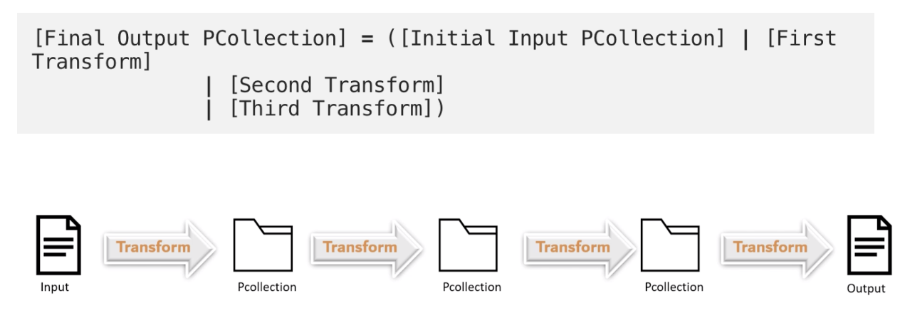
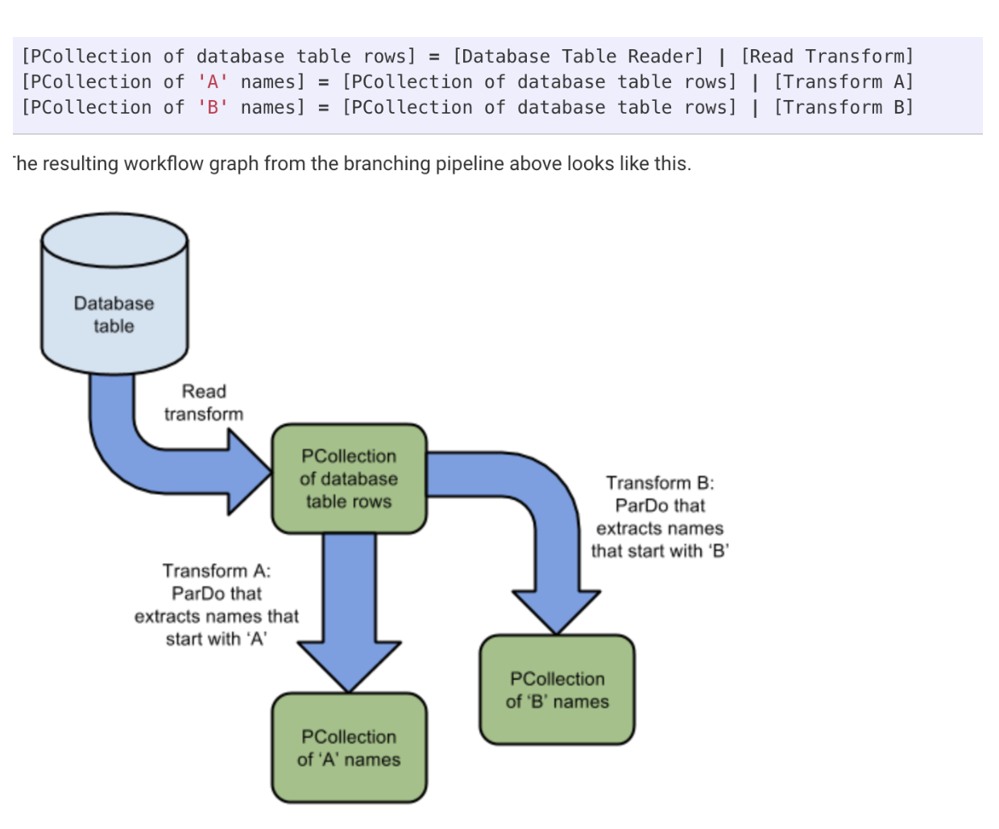
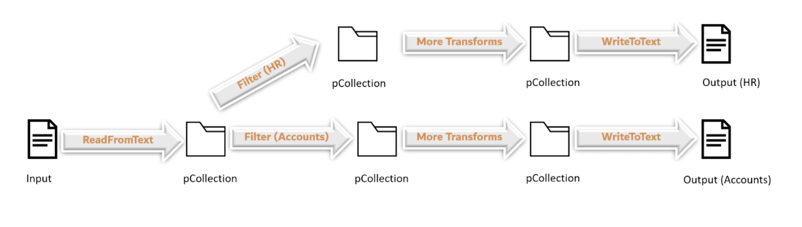
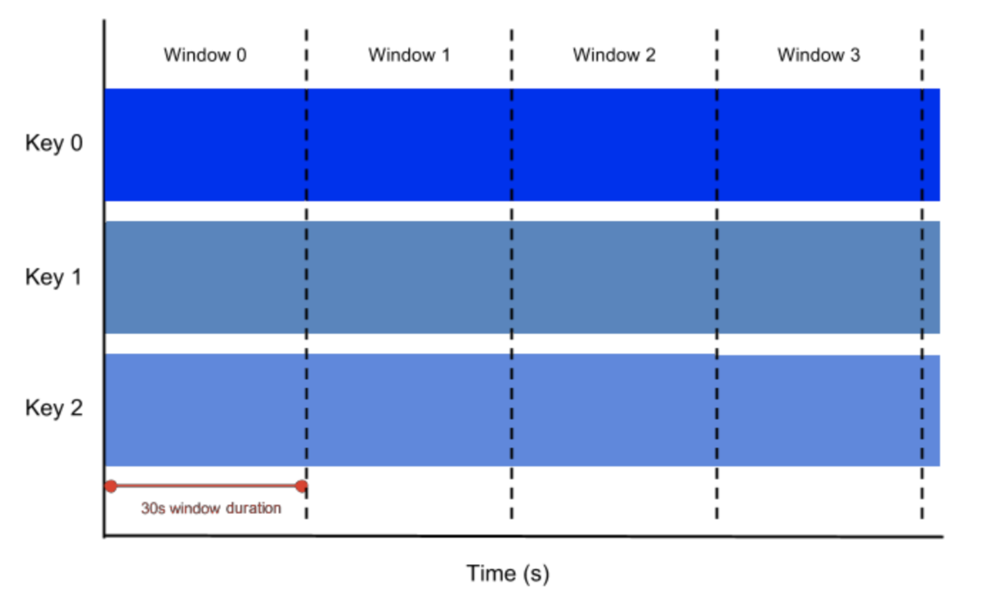
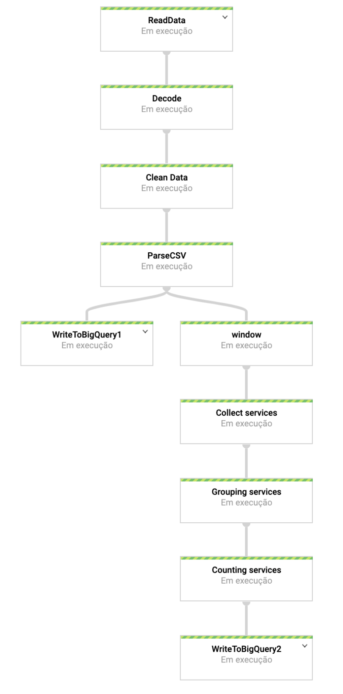

# Documentation
 <center> <h1> Proof of Concept Dataflow</h1> </center>


## Summary
1.[Architecture](#arquitetura)
2.[Brief description Script 002 genlogs.py](#genlogs.py)
3.[Brief description script 003simulastream.py](#simulatream.py)
4.[Brief description  script Pipeline.py](#pipeline.py)
5.[Appendix](#appendix)
6.[References](#references)

### Poc Beam/dataflow

Based on the [model](https://towardsdatascience.com/lets-build-a-streaming-data-pipeline-e873d671fc57), this proof of concept tries to assert about streaming ETLS. Some deliveryables from this test concerns Dataflow concepts and a brief tutorial to beginners in Apache Beam.

  

The main ide is to create a pipeline whom simulates a streaming insertation  with insurance data.Fake data is created to understant how Dataflow can help clean it (Transform) and then load it on Big Query (Google's Data Warehouse).In order to achieve that, I used the python library Faker.To further [reference](https://faker.readthedocs.io/en/master/). A Beam pipeline deals with the whole data process, from beginning to end: From the input data ingestion, transformations on the data, and the output writing .

With helpf from Faker , I was able to create some fake data related to clients from an Insurance company. From there I've simulated these datas being received by an online service. The ingested "Json" data was as follows: 
```
{ time_local} -- {name} {address} Email {email} {birthdate} {service} {plan} {amount} {status}  
```
| "variables"|description |
|--|--|
| time_local |concerns the instant where the transaction was created |
| nome |name of the client |
| email | client's email  |
| birthdate | client's birthdate  |
| service | type of service  |
| plan | type of insuranceplan  |
| amount | price of the transaction |
| status | Whether the transaction was accepted or not |


These logs were used by pub/sub ,further transformed by dataflow and loaded to a dataset in Bigquery.
  


## Architecture  <a name="arquitetura"></a>


<!-- Antes de criarmos qualquer pipe em Beam devemos fazer a seguintes perguntas:

1.Como e onde esses dados estão? Isso determina o tipo de transformação read a ser usada.

2.Qual o tipo desses dados? txt, log files, ou rows em uma tabela?Teremos que decidir se nossa data vai ter uma chave,algumas transformações só funcionam em keys/value pairs.

3.O que você quer fazer com seus dados?beam SDKS já vem com algumas transformações gerais para transformação([Exemplos](https://beam.apache.org/releases/pydoc/2.6.0/_modules/apache_beam/transforms/combiners.html#Mean)) ou temos a opção de determinar nossas core transformations (exemplos ParDO) conforme a necessidade , algumas deles estão no apêndico no fim do documento .

4.Como você quer seu output?Isso determina o tipo de transformação write a ser usada

  

Com essas perguntas em mente, teremos o seguinte pipeline:

Nossos dados são log que serão publicados no pub/sub portanto a primeira transformação tem que ser por conexão ao cloud pub/sub.O dataflow deverá transformar esses logs,o Beam então deverá conectar ao Bigquery e "append" essas linhas na nossa tabela.

A arquitetura dessa POC será:


Os seguintes scripts estão na pasta deverão ser subidos para o ambiente que vamos trabalhar, nessa poc deverá ser nosso cloud shell.

  

pipeline.py >>> usado para execução do nosso pipeline em Apache Beam

genlogs.py >>> para criar a função de geração de logs usando o módulo Faker.

simulastream.py >>> irá publicar os logs pela função criada pelo genlogs.py no Pub/SUb.Enquanto esse script não for abortado ele vai ficar gerando logs no nosso pub/sub ,simulando assim um stream.Serão necessário termos um projeto no gcp; pelo menos um bucket; e um tópico no pub/sub.

## Entendendo Script genlogs.py <a name="genlogs.py"></a>

 ```
from faker import Faker
import time
import random
import os
import numpy as np
from datetime import datetime

approval = ("true", "false")
insurance_plan = ("gold", "diamond", "silver", "black", "white")
typesservice = ("surgery", "dental", "clinic", "auto", "reinsurance", "theft", "others")

LINE = """\
{time_local} -- {name} Email {email} {birthdate} {service} {plan} {amount} {status}\
"""


def generate_log_line():
    fake = Faker()
    now = datetime.now()
    # variables of the log
    time_local = now.strftime('%d/%b/%Y:%H:%M:%S')
    name = fake.name()
    email = fake.email()
    bdate = fake.date_of_birth(tzinfo=None, minimum_age=18, maximum_age=100)  # data de nascimento
    birthdate = bdate.strftime('%d/%m/%Y')  # birthdate is different from local date
    service = random.choice(typesservice)
    plan = random.choice(insurance_plan)
    amount = random.choice(range(100, 10000, 1))
    status = random.choice(approval)

    log_line = LINE.format(
        time_local=time_local,
        name=name,
        email=email,
        birthdate=birthdate,
        service=service,
        plan=plan,
        amount=amount,
        status=status
    )

    return log_line 
   ```


Usando o módulo faker devemos gerar nomes,e-mails,data de nascimento falsos. As colunas approval,insurance_plan,typeservice serão randomizadas entre opções determinadas no nosso script. Será chamada uma função que retorna nossa log_line na formatação estabelecida por nós na string LINE(simulando um log de uma API).
## Entendendo script simulastream.py <a name="simulastream.py"></a>

Esse script é para gerar uma publicação no Pub/sub , cad log_line gerada será publicada no topico estabelecido no script. Um loop será feito para simular um stream, os logs só irão parar quando o usuário abortar o script por ctrl+C.

```
"""
This script imports a function to
generate fake user log data and then
publishes it to a pub/sub topic
"""
from gen_logs import generate_log_line
import logging
from google.cloud import pubsub_v1
import random
import time


PROJECT_ID="my-gce-project1"
TOPIC = "my-gce-project1"


publisher = pubsub_v1.PublisherClient()
topic_path = publisher.topic_path(PROJECT_ID, TOPIC)


def publish(publisher, topic, message):
    data = message.encode('utf-8')
    return publisher.publish(topic_path, data = data)


def callback(message_future):
    # When timeout is unspecified, the exception method waits indefinitely.
    if message_future.exception(timeout=30):
        print('Publishing message on {} threw an Exception {}.'.format(
            topic_name, message_future.exception()))
    else:
        print(message_future.result())


if __name__ == '__main__':

    while True:
        line = generate_log_line()
        print(line)
        message_future = publish(publisher, topic_path, line)
        message_future.add_done_callback(callback)

        sleep_time = random.choice(range(1, 3, 1))
        time.sleep(sleep_time)

```

## Entendendo script pipeline.py<a name="pipeline.py"></a>

Como esse é o script essencial onde todas as transformações da nossa pipeline são definidas , ele será explicado em partes:

A ideia do Beam é criar um pipeline com "|"(pipe) onde podemos processar nossa ETL por stream , cada pipe indica uma etapa nesse processo. O nome Beam que é uma junção entre batch e stream já indica ser possível uma aplicação igualmente simples para batch.

O workflow deve seguir a seguinte estrutura no código:
```
[Final Output Pcollection]=([Initial input Pcollection]
|[First transformation]
|[Second transformation]
|[Third transforamtion])
```


PCollection é uma abstração do conjunto de dados a ser processado pela nossa pipeline.Podemos pensar em uma PCollection como dados "pipeline" e cada uma delas é associada um pipe específico.Como cada pcollection é imutável portanto nós podemos fazer múltiplas transformações no mesmo input, permitindo assim fazemos uma "ramificação",em que duas ou mais partes dos dados serão lidas em paralelo:

Como o objetivo na gênese dessa POC era uma limpeza simples dos logs para colocar no formato desejado da nossa tabela do Bigquery não seria necessário fazer uma ramificação/ branch, onde dois ou mais "ramos" seriam utilizados no nosso job. Mas como esse é um tutorial vamos dividir para mostrar essa funcionalidade, portanto criaremos uma segunda transformação que irá gerá um segundo output no Bigquery.

Resumindo devemos ter dois outputs:
Output1 = Update na Tabela1 do BQ com todos os 08 campos
Output2 = Updade na Tabela2 do BQ com agregados por tipos de serviço.

Exemplo:




## Opções do nosso pipeline

Podemos configurar nosso pipeline criando um objeto PipelineOptions e definindo os argumentos diretamente no nosso script. Contudo,nessa aplicação utilizaremos um parser por linha de comando padrão fornecidos pelo beam SDK.  
Devemos chamar os argumentos pela linha de comando do shell(ambiente dessa aplicação),portanto no nosso script não será necessário discriminar os parâmetros do nosso processo, usaremos a opção padrão:

p = beam.Pipeline(options=PipelineOptions())

No entanto se quisermos executar apenas o script sem nenhum parâmetro na linha de comando ou utilizar via o GCP para chamar um job do dataflow por custom pipeline, é necessário colocar nosso parser dentro do script python. O exemplo abaixo apresenta uma aplicação de tal configuração onde discriminamos no próprio código todos os parâmetros da execução através de programação orientada a objeto.

```
Class myOptions(PipelineOptions):
	@classmethod
	def_add_argparser_args(cls,parser):
		parser.add_argument('--input',
							help='Input for the Pipeline'
							default='gs://mybucket/input')
		parser.add_argument('--output', 
							help='Output for the Pipeline'
							default='gs://mybucket/output')
```


Como devemos chamar o dataflow pela linha de comando devemos chamar os seguintes argumentos:  
```
 python pipeline.py \

--runner DataFlowrunner \

--project $PROJECT \ #id do projeto

--temp_location $BUCKET/tmp \ #id de um bucket para agregar os dados desse streaming

--staging_location $BUCKET/staging # id de um bucket para agregar os dados por estágio do streaming

--streaming # definir o tipo de processo streaming ou batch

--num_workers 2 # se quisermos definir o número de workers do nosso processo.
```

Em relação ao nosso script **pipeline.py** em específico o nosso workflow da primeira tabela deve ficar:

```
csv_lines = (p
                |'ReadData' >> beam.io.ReadFromPubSub(topic=TOPIC).with_output_types(bytes)
                |"Decode" >> beam.Map(lambda x: x.decode('utf-8')) |
                |"Clean Data" >> beam.Map(regex_clean)
                |'ParseCSV' >> beam.ParDo(Split())
                )

    table1 = (csv_lines
              | 'WriteToBigQuery1' >> beam.io.WriteToBigQuery('my-gce-project1:china.POC_BEAM'.format(PROJECT), schema=schema,
                write_disposition=beam.io.BigQueryDisposition.WRITE_APPEND)
              )
```
No contexto acima p é uma instância do apache_beam.Pipeline e a primeira coisa que fazemos é aplicar uma transformação(builtin), *apache_beam.io.textio.ReadFromPubSUB* que irá carregar o conteúdo do pubSub em uma PCollection.

Depois vem uma transformação para encode em utf-8 por [lambda function](https://medium.com/@luijar/understanding-lambda-expressions-4fb7ed216bc5)(python) visto que os dados do pubsub sempre vem em bytes, em seguida uma transformação para aplicar a ordenação que desejamos(regex_clean).

Depois de tudo isso, aplicamos uma lógica específica, Split, para processar cada linha do arquivo de entrada e fornecer uma representação mais conveniente (um dicionário, nesse caso).Finalmente com essa pcollection (csv_lines) vamos criar a última transformação desse primeiro branch que será escrever por append na nossa tabela no Bigquery.

O "Carro chefe" do nosso workflow é a beam.ParDo que é utilizado toda vez que devemos usar uma função em cada elemento separadamente(análogo ao mapReducer do spark).Para saber todas as aplicações do ParDo leia [documentação Beam.pardo](https://beam.apache.org/documentation/programming-guide/#pardo). Nesse tutorial é importante saber que toda vez que chamamos essa transformação é importante que definimos por classe(beam.DoFn) em python.

As transformações serão pelas as funções:
```
def regex_clean(data):  # AWESOME
    PATTERNS = [r'\d+/\w+/\d*:\d*:\d*:\d*', r'(?<=-\s)(\D*)(?=\sEmail)',
                r'\w*\.?\w*@\w*[/|.|-]?\w*[.\w+]*', r'(?<=\s)(\d*\/\d*\/\d*)(?=\s)',
                r'(?<=\s)(theft|auto|surgery|dental|clinic|reinsurance|others)(?=\s)',
                r'(?<=\s)(gold|diamond|silver|black|white)(?=\s\d)',
                r'(?<=\s)([1][\d]{2,3}|[2-9][\d]{2,3}|10000)(?=\s(true|false))', r'(?<=\d\s)(true|false)']
    result = []
    for match in PATTERNS:
        try:
            reg_match = re.search(match, data).group()
            if reg_match:
                result.append(reg_match)
            else:
                result.append(" ")
        except:
            print("There was an error with the regex search")
    result = [x.strip() for x in result]
    result = [x.replace('"', "") for x in result]
    res = ','.join(result)
    return res


# Split return as dictionary the strings collected on the regex function
class Split(beam.DoFn):

    def process(self, element):
        from datetime import datetime
        element = element.split(",")
        d = datetime.strptime(element[0], "%d/%b/%Y:%H:%M:%S")
        d2 = datetime.strptime(element[3], "%d/%m/%Y")  # birthdate is different from local date
        date_string = d.strftime("%d-%m-%Y %H:%M:%S")
        date_string2 = d2.strftime("%d-%m-%Y")
        return [{
            'timelocal': date_string,
            'name': element[1],
            'email': element[2],
            'birthdate': date_string2,
            'service': element[4],
            'plan': element[5],
            'amount': element[6],
            'status': element[7]
        }]
```
**Regex_clean** = deve coletar e retorna apenas os campos que nos interessa do grande string do log.  
**Split** = irá separar cada string e retornar num dicionário com cada coluna.  
**collectservices** = irá coletar apenas as colunas service e amount.

```
class collectservices(beam.DoFn):

    def process(self, element):
        """
        Returns a list of tuples containing services and amount
        """
        result = [(element['service'], element['amount'])]

        return result
```
Já o workflow da segunda tabela deve ser :

```
 table2 = (csv_lines
              |"Collect services" >> beam.ParDo(collectservices())
              |"Grouping services" >> beam.GroupByKey()
              |"Counting services" >> beam.CombineValues(beam.combiners.CountCombineFn())
              |'WriteToBigQuery2' >> beam.io.WriteToBigQuery('my-gce-project1:china.services'.format(PROJECT),schema=schema2,
                write_disposition=beam.io.BigQueryDisposition.WRITE_APPEND)
              )
```

A ideia do nosso segundo ramo é agrupar todos os logs somando a coluna amount pela key service. Ou seja queremos fazer uma transformação que nos indica o total de pedidos por tipo de serviço da seguradora. No entanto, ao usarmos a transformação *CombinePerKey()* é necessário que nosso dados sejam limitados(Bounded Pcollection) em caso contrario não é possivel agrupar os dados porque eles estão sempre crescendo. Portanto estabeleceremos uma janela de tempo que irá coletar esses dados, análogo ao batch.Uma **window** de tempo será fixada para o nosso pipeline coletar todas as linhas criadas pelo nosso pipeline.cEscolhemos uma window de 30 segundos.Abaixo uma representação gráfica da ideia de window:
  
  

A transformação window divide ou agrupa logicamente os elementos de uma PCollection em janelas finitas de acordo com um WindowFn.A janela escolhida será de trinta segundos, note que assim cada log appended da nossa tabela será uma soma dos logs coletados numa janela de trinta segundos.

Chamando os scripts na nossa shell:

```
$python Creatingpipeline.py --runner DataflowRunner --project my-gce-project1 --temp_location gs://my-gce-project1_ab/tmp/ staging location:gs://my_gce-project1_ab/staging/-- streaming --region us-central1
```
  
No exemplo escolhemos tanto o temp_location quanto o staging pastas dentro do nosso bucket. Uma vez chamado esse script, nosso job no dataflow deve ser iniciado.

O nosso streaming workflow deve ficar:



## Apêndice <a name="appendix"></a>
Some useful transformations.

Read Transforms

**ReadfromText()**-parses a text file as a newline delimeted elements.By line will be treated as a single element in the pcollection

Parameters:

1.  file_pattern(str) - the full path of the input file.Can include glob characters:users/data/input*.txt    
2.  min_bundle_size(int)- min size of bundles that should be generated when splitting the source into bundles. (Bundles= batchs of data that will be processed by your runner)
3.  compression_type(str)- specify the compression file of the output
4.  strip_trailing_newlines(bool)- Indicates whether source should be remove the newline character(/n) from each line before reading it.By default true.   
5.  validate(bool)-If set true it will verify the presence of file during pipeline creation.Default true   
6.  skip_header_lines(int)- specify the number of lines you want to skip
    

**ReadFromPubSub()**- Used to read messages from GooglePubSub service.

Parameters:

1.  topic (str)
    
2.  subscription (str)
    
3.  id_label(str)-provide the attributr to be considered as unique indentifier
    
4.  with_attributes(bool) - If set to true ,output elements will be type objects if false >bytes.
    
5.  timestamp_attributes(int)-specify the value to be used as element timestamp.
    

Create transforms

**beam.create()**- used to create data.

Write transforms  
**WriteToText(...)**- Writes each element of the Pcollection as a single line in the output file.

Parameters:

1.  file_path_prefix(str)-This mandatory parameter specifies the file path to write the Pcollection to.Also the files will be written with the specified prefix.
    
2.  file_name_suffix(str)-This specifies the suffix of the output file name.
    
3.  num_shards(int)-This specifies the no.shards/ No. of files written as output
    
4.  append_trailing_newlines(boolean)- Decides if the lines should be delimeted with the newline.by default true.
    
5.  code(str)- Specifies the coder name to encode each line.
    
6.  compression_type(str)-specifies the compression type.
    
7.  header(str)- Specifies the header line of the Output file.
    

**WriteToPubSub (...)**-Writes each element of the Pcollection to Google cloud PubSub services.

Parameters:

1.  Topic(str) :
    
2.  with_attributes(boolean) : type of inputs elements
    
3.  id_label(str) : If set, will set an attribute for each Pub/Sub message with the given name and unique value.
    
4.  timestamp_attribute(int):
    

*Map transforms* : Beam.map()-It takes one input element and one output element.
```
import apache_beam as beam

def Splitrow(element):
	return element.split(',')
	
atendance_count = (
					p1
					|beam.io.ReadFromText('dept_data.txt')
					|beam.Map(SplitRow)
					|beam.io.WriteToText('data/output_new')
)
p1.run()
```
beam.flatmap()- it can output multiple elements for a single input element.

**ParDO transformations**

A ParDO transform takes each element of input Pcollection, performs processing functions on it and emits 0,1 or multiple elements.

Functionalities:

1.  Filtering-ParDo can take each element of Pcollection and decide either to output or discard it.
    
2.  Formatting or Type Conversion- ParDo can change the type or format of input elements
    
3.  Extracting individuals parts- ParDo can be used to extract individuals elements from a single element.
    
4.  Computations- ParDo can perform any processing function on the input elements and outputs a Pcollection

# Referências e leituras externas <a name="references"></a>

[https://medium.com/@brunoripa/apache-beam-a-python-example-5644ca4ed581](https://medium.com/@brunoripa/apache-beam-a-python-example-5644ca4ed581)

[https://towardsdatascience.com/hands-on-apache-beam-building-data-pipelines-in-python-6548898b66a5](https://towardsdatascience.com/hands-on-apache-beam-building-data-pipelines-in-python-6548898b66a5)

[https://beam.apache.org/](https://beam.apache.org/)

[https://medium.com/@selsaber/data-etl-using-apache-beam-part-one-48ca1b30b10a](https://medium.com/@selsaber/data-etl-using-apache-beam-part-one-48ca1b30b10a)

[https://ai.google/research/pubs/pub43864](https://ai.google/research/pubs/pub43864) -->